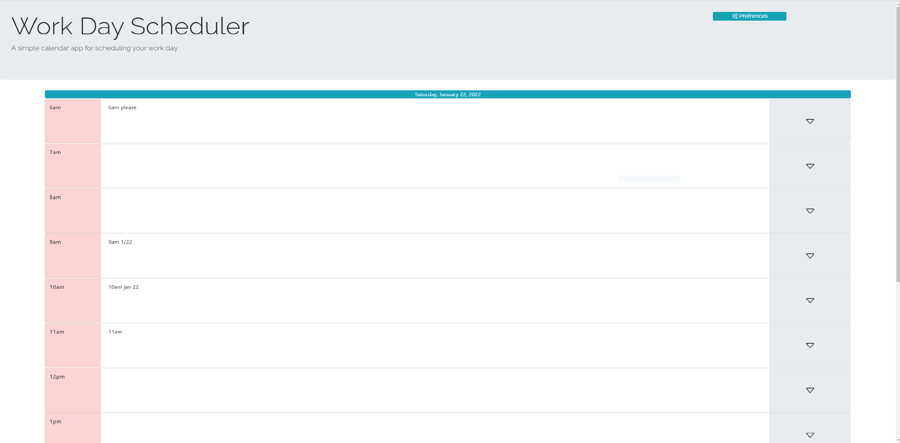
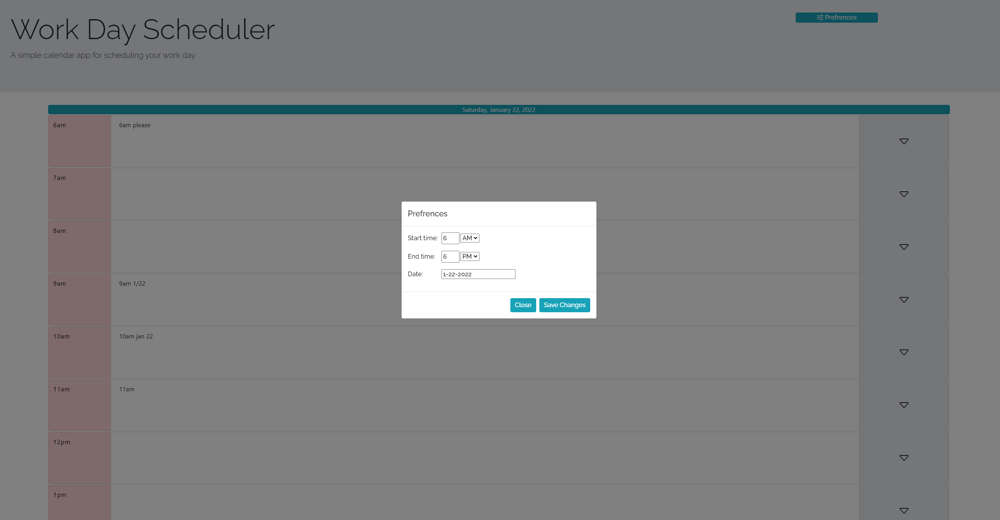

# Day-Planner

## Intention

My intention with thhis program was to create a simple day planner. I wanted the planner to have the following features; ability to edit tasks, ablitliy to save tasks in local storage, ability to change displayed date, ability to change disaplyed time range. I also wanted to use Luxon as a time library in order to familiarize myself with it. 

## Challenges

I had two main challenges in the creation of this program. The first was creating a method to store an entire days worth of tasks and retrieve it later. The second was using Luxon, I had a tremendous amount of difficulty with it at first but now have a good grasp. 

## Externals Used

- JQuery
    - DOM Manipulation, element creation
- Jquery UI
    - Datepicker widget
- Boostrap 
    - List items, jumbotron, grid layout, icon
- Luxon
    - Time and date usage
- Google fonts 
    - Document font
- FontAwesome
    - Icons

## Function Structure/Flow

- document.ready
    - createContainer
        - createSchedule
            - retrieveDay
                - getLocalStorage
                    - createNewObject
                    - createNewArray
                - amorPM
                - retrieveTask
                - dueAudit
- task item on click
- save item on click
    - storeTask
        - storeObject
- show modal
    - dateFormatChanger
    - amOrPM
- modal save button on click
    - checkNewTimes

## 

Deployed at:
https://atticus-robinson.github.io/day-planner/

## Page Images 

